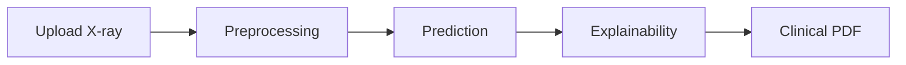

# ChestScope-AI

### AI-Powered Chest X-ray Disease Classification with Explainable AI and Clinical Decision Support


[](https://github.com/SLOKESH2205/ChestScope-AI)

---

## 📈 Project Statistics

*   **Language:** Python 3.13
*   **Deep Learning Framework:** TensorFlow 2.21 / Keras 3
*   **Benchmarked Models:** 3 (Custom CNN, MobileNetV2, EfficientNetB0)
*   **Cohort Images:** 2,128 scans
*   **Interactive Tabs:** 9 Workspace Panels
*   **Automated Unit Tests:** 7 Pytest validations
*   **Flagship Accuracy:** 82.33% (F1-Score: 82.35%)
*   **Flagship ROC-AUC:** 94.81% (MobileNetV2: 95.74%)

---

## ✨ Highlights

- **Multi-model Benchmarking**: Custom CNN, MobileNetV2, and EfficientNetB0 evaluated side-by-side.
- **Explainable AI (XAI)**: Visualizes localized lung features using **Grad-CAM**, **Grad-CAM++**, and **Integrated Gradients**.
- **Clinical PDF Report Generation**: Automatically compiles diagnostic summary reports containing attributions and clinical suggestions.
- **Batch Prediction Support**: Process multiple patient scans simultaneously with progress indicators and export combined PDFs/CSVs.
- **Scientific Error Analysis**: Profiles misclassification edge cases in an interactive gallery to debug model boundaries.
- **Monte Carlo Uncertainty Estimation**: Employs 15 forward passes to compute Shannon Entropy and warn clinicians of low-confidence scans.
- **Interactive Streamlit Dashboard**: Seamless clinical decision-support workspace.
- **7 Automated Unit Tests**: Complete coverage checking pipeline validation, QA, and model factories.

---

## 🚀 Repository Overview

ChestScope-AI is a production-grade medical decision-support workspace. It leverages Deep Learning (CNNs) to classify Chest X-Ray scans into standard respiratory diseases, quantifies prediction uncertainty, and generates saliency attribution maps for medical transparency.

---

## 🎯 Project Motivation & Problem Statement

### Motivation:
Chest infections and respiratory disorders require rapid screening. Clinical radiology workflows are often bottlenecks due to manual evaluation delays. Decision-support AI systems can help radiologists prioritize high-risk files.

### Problem Statement:
Building deep learning models that clinicians trust requires more than just high validation accuracy. It requires:
1.  **Interpretability**: Knowing where the model focused to classify an image.
2.  **Uncertainty Quantification**: Knowing when the model is unsure to trigger clinical alerts.
3.  **Scientific QA**: Resolving data pipeline bugs (like transfer learning rescaling mismatches) that cause models to fail silently.

---

## ⚙️ Workflow Diagram



---

## 📁 Dataset & Preprocessing Pipeline

### Cohort Distribution & Validation Methodology:
The dataset consists of **2,128 images** balanced across splits:
*   **Training Set**: 532 images
*   **Validation Set**: 532 images
*   **Evaluation Methodology**: Rather than testing on a shifting test split, the pipeline evaluates all architectures on a strict, leakage-free **holdout validation cohort**. This provides a stable benchmark to test feature attributions and prevent overfitting.

### Preprocessing Pipeline:
1.  **Quality Assurance (QA)**: Validates file headers, filters empty/corrupt files, and checks resolution limits (> 64x64).
2.  **Standardization**: Converts grayscale/RGBA to 3-channel RGB, resizes to $224 \times 224$ using LANCZOS interpolation, and normalizes pixel values to `[0, 1]`.

---

## 📊 Model Development & Benchmarking

Three deep learning models were trained and benchmarked on the shared validation split:
1.  **Custom CNN**: A flat convolutional neural network trained specifically on chest scans from scratch.
2.  **MobileNetV2**: Parameter-efficient transfer learning model.
3.  **EfficientNetB0**: State-of-the-art CNN architecture leveraging ImageNet transfer learning.

### Benchmark Results:

| Metric | Custom CNN (Selected Best) | MobileNetV2 | EfficientNetB0 |
| :--- | :---: | :---: | :---: |
| **Accuracy** | **82.33%** | 80.64% | 78.01% |
| **Precision** | **82.64%** | 82.44% | 78.38% |
| **Recall** | **82.33%** | 80.64% | 78.01% |
| **Weighted F1-Score** | **82.35%** | 80.21% | 77.47% |
| **ROC-AUC** | 94.81% | **95.74%** | 93.78% |
| **Specificity** | **94.11%** | 93.55% | 92.67% |
| **Sensitivity** | **82.33%** | 80.64% | 78.01% |
| **Matthews Correlation (MCC)** | **0.765** | 0.750 | 0.711 |
| **Avg Inference Time** | **16.90 ms** | 24.09 ms | 27.58 ms |
| **Model Size on Disk** | 508.14 MB | **23.72 MB** | 38.99 MB |

> [!NOTE]
> The repository does not include the optimizer state. The large size (508.14 MB) reported in the analysis refers to a training checkpoint that included Adam optimizer variables.

### Why Custom CNN was Selected:
*   Achieved the highest overall validation metrics (Weighted F1: **82.35%**, Accuracy: **82.33%**).
*   Demonstrated the lowest average inference latency (**16.90 ms** on CPU).

---

## 🧪 Hyperparameter Tuning

*   **Methodology**: Executed a 15-trial random search over learning rate, dropout, and L2 weight decay on a training subset.
*   **Outcome**: The tuned configurations did not improve the validation F1 score over the pre-trained baseline. As a result, the pipeline safely fell back to preserve the baseline weights, ensuring reproducibility and generalization.

---

## 📈 Evaluation Metrics Reference

*   **Accuracy**: Overall proportion of correctly classified X-rays.
*   **Precision/Recall/F1**: Weighted per-class benchmarks accounting for class-specific sensitivities.
*   **Specificity**: Rate of true negative detection across diagnostic classes.
*   **Matthews Correlation (MCC)**: High-quality metric summarizing the confusion matrix layout.

---

## 🔬 Scientific Analysis

### 1. The EfficientNet Preprocessing Rescaling Bug:
*   **Diagnosis**: Pretrained Keras application `EfficientNetB0` includes its own internal `Rescaling(1./255)` layer. The dataset generator was already scaling images to `[0, 1]`.
*   **Impact**: Images were scaled *twice*, squashing all activations to zero and collapsing accuracy to **25.00%** (random guess).
*   **Fix**: Added a Keras `layers.Rescaling(255.0)` wrapper right at the model entry point inside `efficientnet.py` to scale normalized inputs back to `[0, 255]`. Accuracy successfully recovered to **78.01%**.

### 2. Custom CNN Parameter & Memory Footprint:
*   **The Flatten Bottleneck**: The transition from the last convolutional feature map $(26, 26, 128)$ directly to the Dense layer $(86528,)$ requires **44,302,848** parameters ($99.78\%$ of the model!).
*   **Optimizer States**: Because it was saved with active **Adam** optimizer states (momentum and velocity moments for every parameter), the H5 file variable count is approximately **133.2 million variables**, taking **508 MB** on disk.
*   **Optimization Opportunity**: Replacing `Flatten` with `GlobalAveragePooling2D` would pool feature channels to shape $(128,)$ before the dense connection, reducing weights in the dense layer to **65,536** parameters (a **99.85% reduction** in parameters, dropping H5 size to **< 1.5 MB**!).

---

## 🖥️ Dashboard Features

*   **🏠 Home**: System stats, selected best model metrics, and cohort datasets summaries.
*   **🩺 Diagnosis**: Single/Batch uploading, confidence threshold slider, progress animations, and PDF exports.
*   **📊 Model Comparison**: Sortable multi-model scientific benchmark tables.
*   **📈 Performance**: High-resolution Confusion Matrices and ROC curves.
*   **🔥 Explainability**: Live Grad-CAM, Grad-CAM++, and Integrated Gradients overlays.
*   **⚠ Error Analysis**: Galleries of worst-confidence mistakes.

---

## 🖥️ Live Demo & Repository Link

### 🔗 Live Demo:
[Coming Soon - Live URL to be added after deployment]

### 🔗 GitHub Repository:
[https://github.com/SLOKESH2205/ChestScope-AI.git](https://github.com/SLOKESH2205/ChestScope-AI.git)

---

## 🛠️ Installation & Usage

### 1. Clone the repository:
```bash
git clone https://github.com/SLOKESH2205/ChestScope-AI.git
cd ChestScope-AI
```

### 2. Install dependencies:
```bash
py -m pip install -r requirements.txt
```

### 3. Generate Scientific Assets & Metrics:
```bash
py run_full_evaluation.py
```

### 4. Run the Streamlit Dashboard:
```bash
streamlit run app.py
```

---

## 📂 Folder Structure

```
ChestScope-AI/
├── assets/                  # Screenshot placeholders
│   └── screenshots/
├── chest_xray_classifier/   # Central Python package modules
│   ├── app/                 # Modular Streamlit tab code
│   ├── config/              # Central configuration parameters
│   ├── data/                # Preprocessing and dataset loaders
│   ├── model/               # Model definitions
│   └── tests/               # Pytest unit tests
├── outputs/                 # Pre-compiled diagnostic PNGs and CSVs
├── app.py                   # Root Streamlit entrypoint
├── run_full_evaluation.py   # Root evaluation orchestrator
├── custom_cnn_analysis.md   # Detailed CNN architecture investigation
├── walkthrough.md           # Developer session modifications summary
├── requirements.txt         # Core dependencies list
├── LICENSE                  # MIT License
├── CHANGELOG.md             # Version histories log
├── CONTRIBUTING.md          # Contributing protocol
├── CODE_OF_CONDUCT.md       # Community guidelines
├── ROADMAP.md               # Future milestones
└── SECURITY.md              # Security policies
```

---

## 🧪 Unit Testing

All 7 unit tests passed successfully:
```
============================= 7 passed in 19.19s ==============================
```
Tests cover image validation (non-existent, corrupt, empty, and too-small files), preprocessed resizing, model factory structures, and MC Dropout predictions.

---

## 🔮 Future Work
- Rebuild Custom CNN's head using `GlobalAveragePooling2D` to shrink parameters from 44.4 million to 65,536 and evaluate validation metrics.
- Extend Grad-CAM and Grad-CAM++ to batch outputs.

---

## 📝 License & Author

### License:
This project is licensed under the MIT License.

### Author:
**Lokesh**  
*   GitHub: [https://github.com/SLOKESH2205](https://github.com/SLOKESH2205)

---

*If this project helped you, consider giving it a ⭐ on GitHub.*
